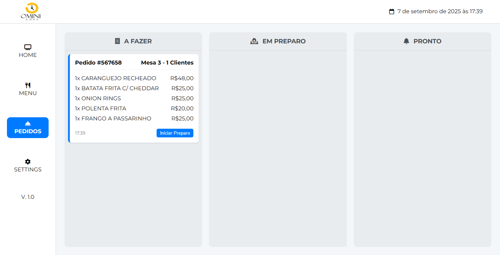

# 🍽️ Aplicativo OmniChef

## 📌 Sobre o Projeto
O **OmniChef** é um sistema de **Ponto de Venda (PDV)** desenvolvido para restaurantes e lanchonetes, com foco em **automação de processos**, **controle de pedidos**, **administração de mesas** e **fidelização de clientes**.  

---

## 🚀 Funcionalidades
- 📋 **Gestão de Mesas**: controle visual do status (livre/ocupada) e quantidade de clientes.  
- 🍔 **Gestão de Pedidos**: criação, edição e acompanhamento em tempo real.  
- 📊 **Gerenciamento**: relatórios e monitoramento de vendas.  
- ⚙️ **Configurações**: personalização de itens e categorias do menu.  
- 🔒 **Integração com Firebase**: autenticação e banco de dados em tempo real.  

---

## 📂 Estrutura do Projeto
```
APLICATIVO_OMNICHEF
├── public
│   └── assets
│       └── images
│           ├── icons       # Ícones do sistema
│           └── imagens     # Imagens gerais
├── src
│   ├── global              # Configurações globais
│   ├── js                  # Scripts JS e firebase-config
│   └── pages
│       ├── clientes        # Página de clientes
│       ├── configuracao    # Página de configurações
│       ├── controle-mesas  # Controle de mesas
│       ├── gerenciamento   # Gestão administrativa
│       ├── home            # Página inicial
│       ├── menu            # Cardápio
│       └── pedidos         # Pedidos ativos
└── README.md
```

---

## 🛠️ Tecnologias Utilizadas
- **Frontend:** HTML, CSS, JavaScript  
- **Backend:** Firebase (Realtime Database / Firestore)  
- **Ferramentas de Desenvolvimento:** Git, VS Code  

---

## ⚙️ Como Executar
1. Clone o repositório:
   ```bash
   git clone https://github.com/seu-usuario/APLICATIVO_OMNICHEF.git
   ```
2. Acesse a pasta do projeto:
   ```bash
   cd APLICATIVO_OMNICHEF
   ```
3. Abra no **VS Code** e execute com **Live Server** ou outro servidor local.  

---

## 📸 Demonstração
Aqui estão algumas telas do sistema (substitua os links abaixo pelas imagens reais do projeto):  

| Tela Inicial | Controle de Mesas |
|--------------|-------------------|
|  |  |

| Menu | Pedidos |
|------|---------|
|  |  |

---

## 📑 Documentação
A documentação completa do projeto pode ser acessada no link abaixo:  

👉 [📄 Documentação do Projeto (PDF)](public\assets\readme\docs\PI_Grupo_02_OmniChef.pdf)  


---

## 👥 Desenvolvedores
- [**Bruno Santos Marques**](https://github.com/Bruno-SMarques)  
- [**Gabriel dos Anjos de Oliveira Moura**](https://github.com/Gabr1el-Anjos)  
- [**Gervasio Lopes de Sousa Filho**](https://github.com/GervasioLopes)  
- [**Igor Mendes Coelho de Araujo Santos**](https://github.com/ak4maru)  
- [**Luiz Fernando de Oliveira Penteado**](https://github.com/LuizFPenteado)  

---

📌 **Status do Projeto:** 🚧 *Em desenvolvimento*  